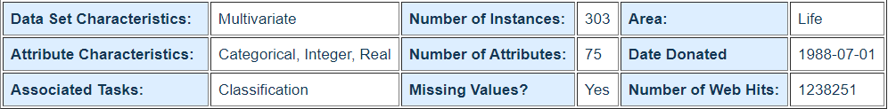
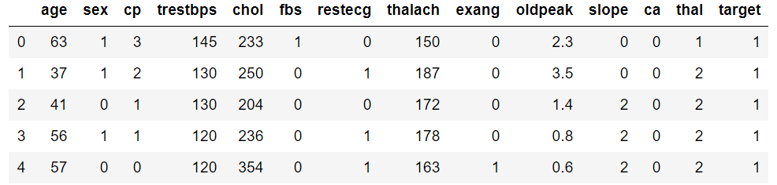
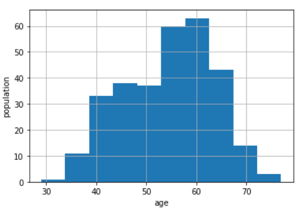
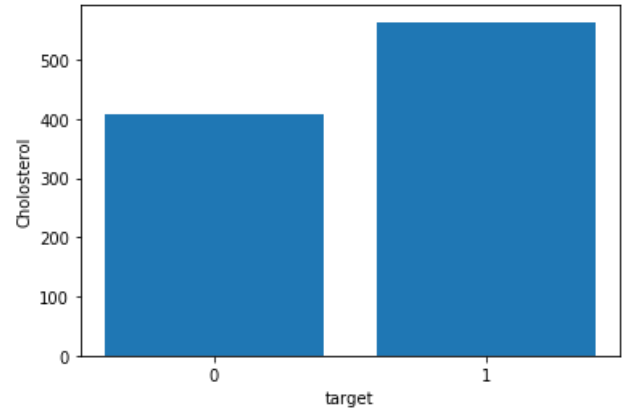
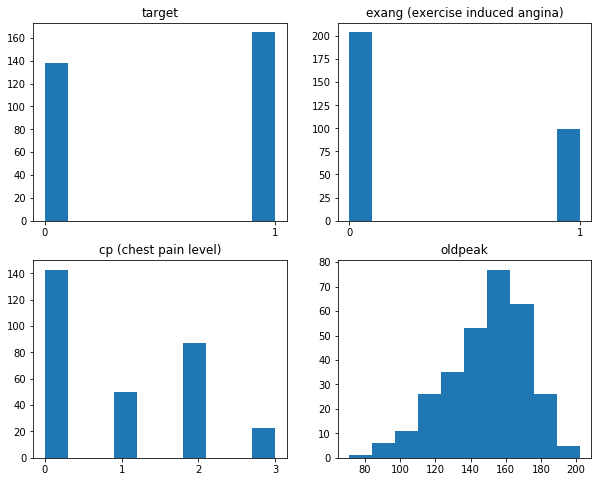
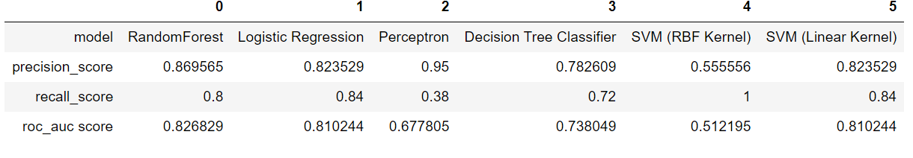
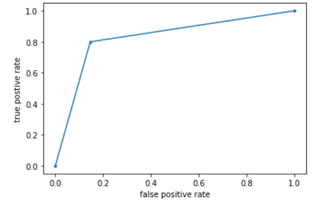

<b>HEART DISEASE DETECTION USING MACHINE LEARNING MODELS</b>

<b>
ABSTRACT
</b>

Aim of the project is to find whether a patient has heart disease, such a prediction is found using various machine learning models with optimization techniques used to find the best fitting model to solve the problem. The project was based on the data of heart disease patients, wherein there are 13 features for each patient using which to determine if a person has a heart disease condition or not. Considering the aim of the project presents a binary classification, hence binary classification machine learning models were used. Among the various machine learning models, the Random Forest Classifier was found to have the highest accuracy score, surprisingly found to be higher than multiple SVM models. 

<b>
INTRODUCTION 
</b>

Medicine has evolved to aid us in surviving through the hail storms of diseases dormant in modern day society. Among which, Cardiovascular diseases (CVD) is a major one, as its touted to be the highest cause for death globally. In 2016 an estimated 17.9 million people were found to have died from CVD’s; representing almost 31% of global deaths annually. Among these deaths, heart attack and stroke have been the major symptom for 85% of those annual estimates. Hence to reduce such high prevalent risks, it would be helpful to detect the likelihood of a patient having a heart disease in order to cure and prevail the condition from occurring. 

<b> Data Sourced from UCI Machine learning repository:</b>

<b> 
DATA ANALYSIS
</b>

The data as shown in figure below, shows the first 5 rows of the dataset. 

Age demographic of the patients with and without heart disease

Cholesterol level in patients (0: no heart disease, 1: has heart disease)

<b>
INTERPRETATIONS AND FINDINGS
</b>

correlated features against their population density

Accuracy scores of all models tested upon:

Area Under the Curve (FPR vs TPR) of Random Forest Classifier:

<b>
CONCLUSION
</b>

The aim of the Project was to find predict if a person will get heart disease based on 13 medical features using machine learning model and optimization. Such machine learning models were used, with its most optimized counterparts. From the range of Supervised classification models used Random Forest Classifier was seen to have the highest accuracy score among the others with 82.7%. 

<b> Bibliography: </b>
 1. Andras Janosi, Andras, et al. “Heart Disease Dataset.” UCI Machine Learning Repository: Heart Disease Data Set, 2006, archive.ics.uci.edu/ml/datasets/Heart+Disease.
2. Andras Janosi, Andras, et al. “Heart Disease Dataset.” Kaggle heart disease UCI: Heart Disease Data Set, 2006, archive.ics.uci.edu/ml/datasets/Heart+Disease.
3. WHO, WHO. “Cardiovascular Diseases (CVDs).” World Health Organization, World Health Organization, 2017, www.who.int/news-room/fact-sheets/detail/cardiovascular-diseases-(cvds)#:~:text=CVDs%20are%20the%20number%201,to%20heart%20attack%20and%20stroke.

